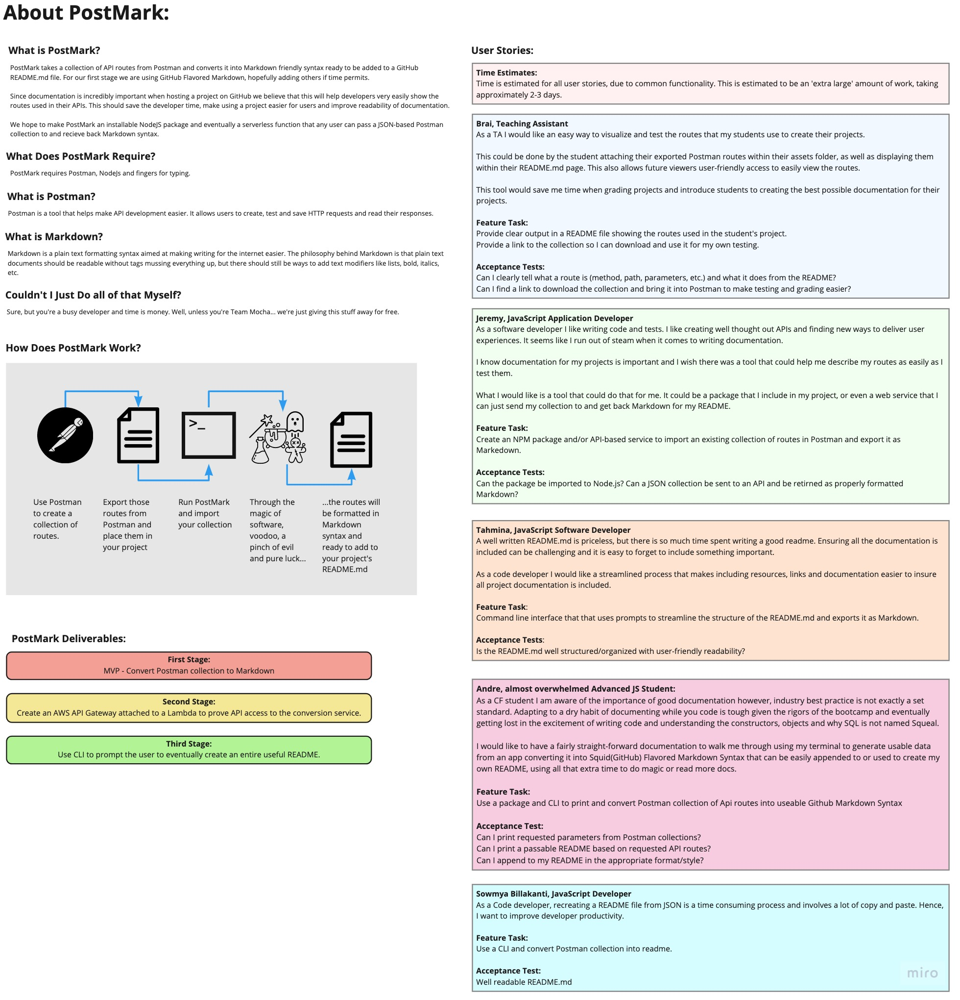

# PostMark
A small Node.js program to convert Postman collections to Markdown friendly syntax.

## Authors

Andre Olivier Martin - @Doktor-Doom

Jeremy Penning - @pixeljava

Sowmya Billakanti - @SowmyaBillakanti

Tahmina Ringer - @tahminaringer

## Requirements

- [Requirements](./requirements.md)

## Whiteboard/UML

