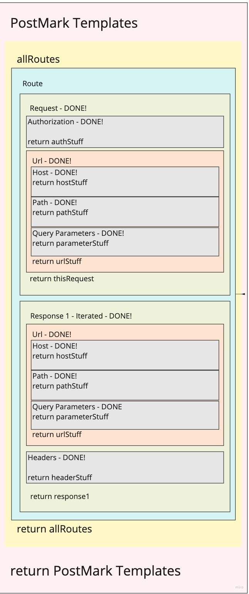

# PostMark
A small Node.js program to convert Postman collections to Markdown friendly syntax. PostMark takes a collection of API routes from Postman and converts it into Markdown friendly syntax ready to be added to a GitHub README.md file. For our first stage we are using GitHub Flavored Markdown, hopefully adding others if time permits.

Since documentation is incredibly important when hosting a project on GitHub we believe that this will help developers very easily show the routes used in their APIs. This should save the developer time, make using a project easier for users and improve readability of documentation.

PostMark is now available as an installable NodeJS package (at https://www.npmjs.com/package/postmark-it) and is running as a serverless AWS Lambda function (at https://postmark.pixeljava.com/convert) that any user can pass a JSON-based Postman collection to and recieve back Markdown syntax. A site has been created to make the conversion process easier: https://postmarkui.herokuapp.com

## Problem Domain: Auto-generating documentation for JSON.
The app takes a Postman Collection JSON file as input and outputs the documentation template in .md format.

### Why We Created PostMark:
- The manual process of documenting routes is unecessarily repetitive.
- It is also potentially error prone, creating the possibility of incorrect documentation.

### What Problems it Solves:
- Eliminates the manual process of documenting API routes.
- Minimizes errors in manual copying.

## Whiteboard/UML

## Requirements

- [Requirements](./requirements.md)

## Resources/Links

#### Node.js
- [NodeJS.org - How to Prompt for CLI Input](https://nodejs.org/en/knowledge/command-line/how-to-prompt-for-command-line-input/)
- [NodeJS.org - FS API](https://nodejs.org/api/fs.html#fs_class_fs_dir)
- [GitHub - Prompt](https://github.com/flatiron/prompt)
- [StackOverflow - Current Directory Used by FS](https://stackoverflow.com/questions/42972785/what-is-the-current-directory-used-by-fs-module-functions)
- [W#Schools.com - NodeJS Filesystem](https://www.w3schools.com/nodejs/nodejs_filesystem.asp)

#### Markdown Features in GitHub
- [GitHub.com - Mastering Markdown](https://guides.github.com/features/mastering-markdown/)

#### Postman V2.1 Collection Schema
- [Postman - Postman v2.1 Collection Schema](https://schema.getpostman.com/json/collection/v2.1.0/collection.json)

#### NPM Publish
- [Medium - Building and Publishing Your First NPM Package](https://medium.com/the-andela-way/build-and-publish-your-first-npm-package-a4daf0e2431)
- [StackOverflow - NPM Error](https://stackoverflow.com/questions/22343420/npm-not-creating-bin-directory)
- [NPMJS.org - Building a Simple CLI Tool with NPM](https://blog.npmjs.org/post/118810260230/building-a-simple-command-line-tool-with-npm)

## Authors

Andre Olivier Martin - @Doktor-Doom

Jeremy Penning - @pixeljava

Sowmya Billakanti - @SowmyaBillakanti

Tahmina Ringer - @tahminaringer
