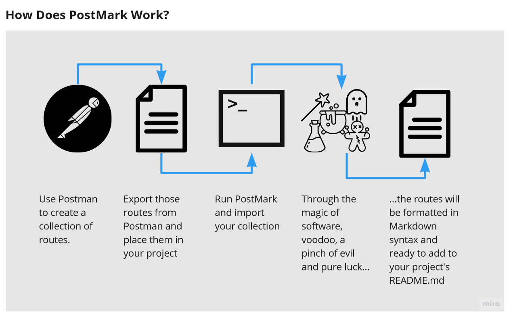
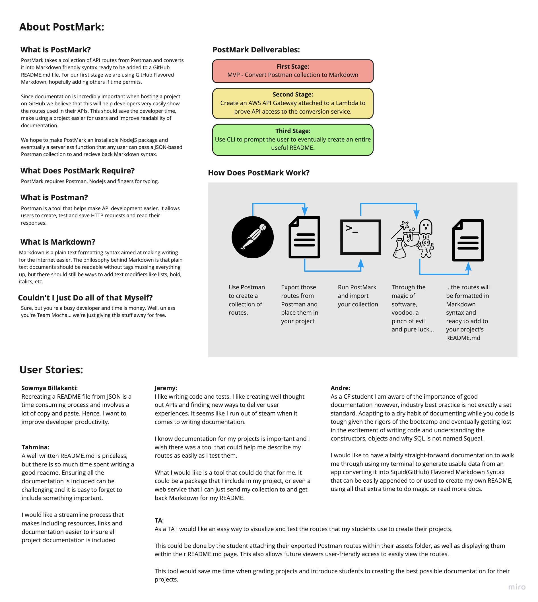

# Vision

PostMark takes a collection of API routes from Postman and converts it into Markdown friendly syntax ready to be added to a GitHub `README.md` file. For our first stage we are using GitHub Flavored Markdown, hopefully adding others if time permits.

Since documentation is incredibly important when hosting a project on GitHub we believe that this will help developers very easily show the routes used in their APIs. This should save the developer time, make using a project easier for users and improve readability of documentation.

We hope to make PostMark an installable NodeJS package and eventually a serverless function that any user can pass a JSON-based Postman collection to and recieve back Markdown syntax.

## Scope

### IN - What does our product do?

- Conversion from Postman collection exports to GitHub Flavored Markdown.
- Creates well formated route visualization.
- Provides easy access to route testing.
- Node.js package that can be installed with npm.
- AWS Lambda function providing API access to our conversion service.

### OUT - What will your product not do?

- It will not teach the user how to create a proper Postman collection.
- Does not create code for routes in a Postman collection.
- Does not provide a graphical user interface

## Project Goals

### MVP

- Is to convert Postman collection to Markdown

### Stretch Goals

1. Create an AWS API Gateway attached to a Lambda to prove API access to the conversion service.
2. Use CLI to prompt the user to eventually create an entire useful README.

### Functional Requirements

- User can import a Postman collection and receive back formatted Markdown syntax in their README.md or a separate document.
- User can send the Postman collection JSON object to AWS Lambda function and receive back formatted Markdown syntax.

### Data Flow

### Software Requirements

- Postman - API developement/testing tool
- Node.js - JavaScript framework
  - fs - File system access
  - prompt - Command line information to variables
- Jest - For testing
- AWS - Amazon Web Service
  - API Gateway - Creates REST/HTTP routes
  - Lambda - Serverless functions
- GitHub/git - Version control software

## Non-Functional Requirements

- Testability - We should be able to test:
  - Inputting a Postman collection (exported from Postman and not edited after the export).
  - Testing that JSON on import, accounting for all of the objects that we will eventually need to use in our output.
  - Common issues like missing data should gracefully degrade to a section of output being created but left empty. (The user can fill this out later).
  - Any problems with file input should be returned to the user in the most accurate and helpful way possible.

- Usability - User should be able to:
  - Assume that putting a Postman collection in their assets folder is a good default location.
  - However, user should be able to change the location of their Postman collection.
  - Expect their well documented Postman collection to be exported in GitHub compatible Markdown syntax.
  - That exported Markdown syntax should create a visually appealing, informative display of their routes.

## Full Whiteboard/UML

